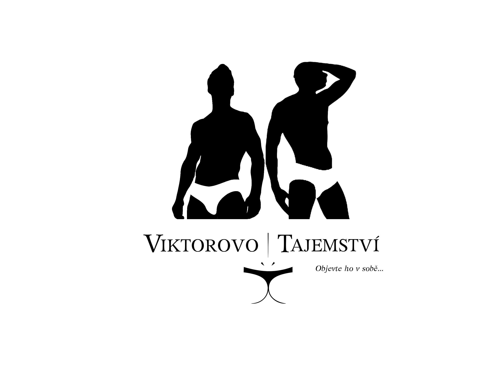
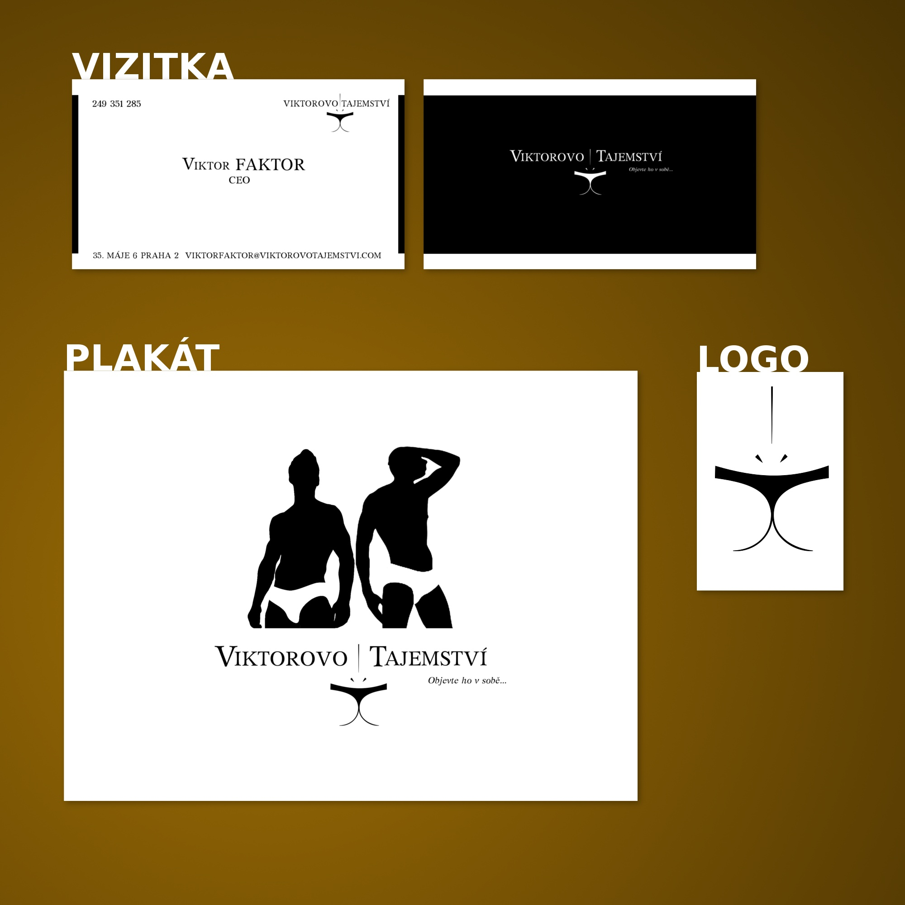

# KIV/POKR - Počítačová podpora kreativity

Semestrálka - vytvořit logo, vizitku, plakát a kampaň pro smyšlenou firmu. Hodnotí se kreativita.

## Viktorovo tajemství

### Plakát

### Preview

## Detaily kurzu
* Katedra informatiky a výpočetní techniky
* Fakulta Aplikovaných Věd - ZČU Plzeň (University of West Bohemia)
* letní semestr 2013
* vyučující - [Prof. Dr. Ing. Ivana Kolingerová](https://www.kiv.zcu.cz/cz/katedra/osoby-seznam/osoba-detail.html?login=kolinger)
